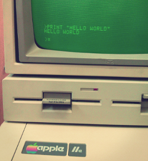
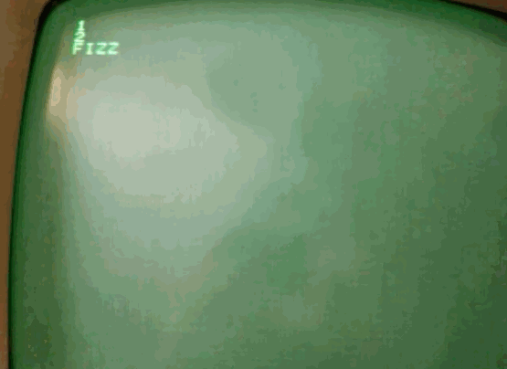
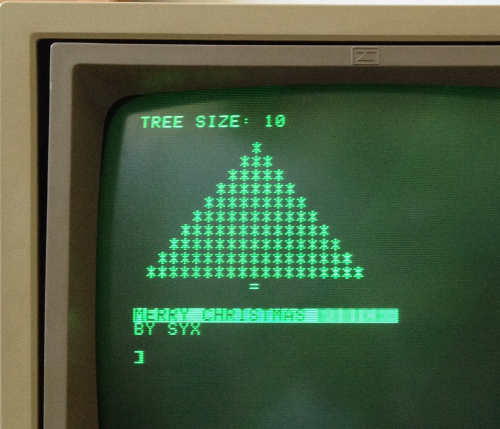

# Apple II Memories

A European Apple IIe I found in an old school.

Here you can find some of the programs I wrote on this old Apple II in [Applesoft BASIC](http://en.wikipedia.org/wiki/Applesoft_BASIC) language.

## First test

Fizz-Buzz :heart:

## Last test

A lovely Christmas tree :christmas_tree:

## About

Believe it or not this was my first time coding in a BASIC dialect (Applesoft BASIC) using GOTO and ancient stuff like that, please don't judge the quality of the code :P

Oh check [this](https://www.youtube.com/watch?v=O4g9vayWAKw) and [this](https://www.youtube.com/watch?v=Hx0lM9mq_M8) out too!
