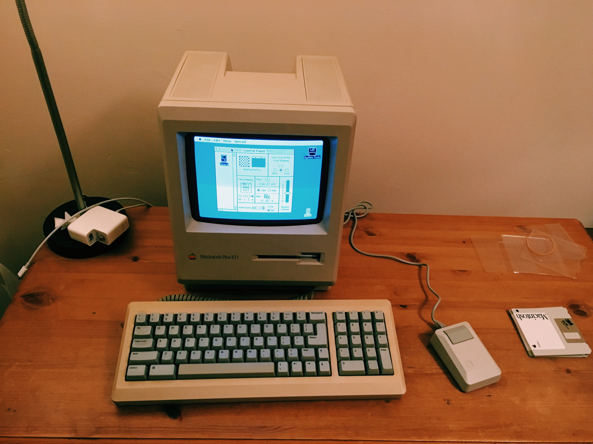
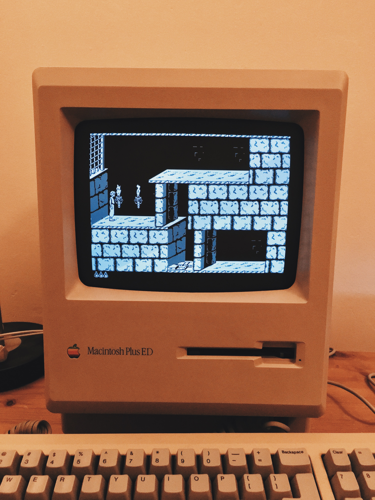

# Macintosh Plus
> リサフランク420 / 現代のコンピュー

This is a Macintosh Plus ED I bought on an eBay auction. The ED stands for _education_, which I assume was the market target for this line of Macintosh. More info [here](https://everymac.com/systems/apple/mac_classic/specs/mac_plus.html).

It was sold with a shiny [Apple M0110A](https://deskthority.net/wiki/Apple_M0110A) and a [M0100](https://512pixels.net/2012/11/mouse/) mouse.

At this point there wasn't much I could do with it. The previous owner of this machine provided 4 floppy discs with useless software for configuring printers and networks, but luckily for me I could load a working [System 6.0.8](https://en.wikipedia.org/wiki/System_6) to play with. Still the only two useful apps on this yoke were a [Calculator](https://www.folklore.org/StoryView.py?story=Calculator_Construction_Set.txt) and TeachText.

## Big Mess O' Wires to the rescue

Few days later after playing with the calculator almost every afternoon for some solid 5 minutes, I was still struggling to justify the expensive purchase. Decided to go online and looked for possible ways to emulate a floppy disk or a hard disk drive in order to play some old games and programs.

I discovered pretty quick that the great [Steve Chamberlin](https://www.bigmessowires.com/about/) made a gadget which was doing exacly that!

So as a _second_ Christmas present I bought myself a [Floppy Emu](https://www.bigmessowires.com/shop/product/floppy-emu-model-c/). I really can't tell the joy of having a fully working Macintosh Plus and the possiblity to load old software into it. Notice as a usual rite of passage, for any old computer I own, the Prince of Persia gameplay :)

## Photoshop 1.0

Another experiment I decided to try was loading the first version of Photoshop, or to be precise the [0.63 and 1.0.7](https://winworldpc.com/product/adobe-photoshop/10). It honestly took me a while to find a good copy online. Useless to say it's some really fine piece of software for its age although I did encounter some unusually slow loading bars when rendering some pictures.

The **final test** was to export a picture made with _MacPaint_ onto a modern operating system in order to upload it on my website or simply to see if I could do it. Long story short I actually achived this by:

* creating the picture in MacPaint
* opening the picture in Photoshop 1.0 and exporting it as a readable format (CompuServe GIF)
* saving the gif on the hard disk emulated with Floppy EMU
* transfering hard disk image file from the SD Card to my Macbook Pro
* loading the hard disk image into [Mini vMac](https://www.gryphel.com/c/minivmac)
* exporting the actual gif image inside the hard disk using [ExportFl](https://www.gryphel.com/c/minivmac/extras/exportfl)

And _boom_ here's the final [picture](images/pippo.gif). Now open it with an [hex editor](https://hexed.it) and read the first **6 bytes** ;)

Here's a full detailed explanation of how I accomplished this experiment: https://system32.simone.computer/post/2

While here's a small tutorial I recorded during the pandemic:

