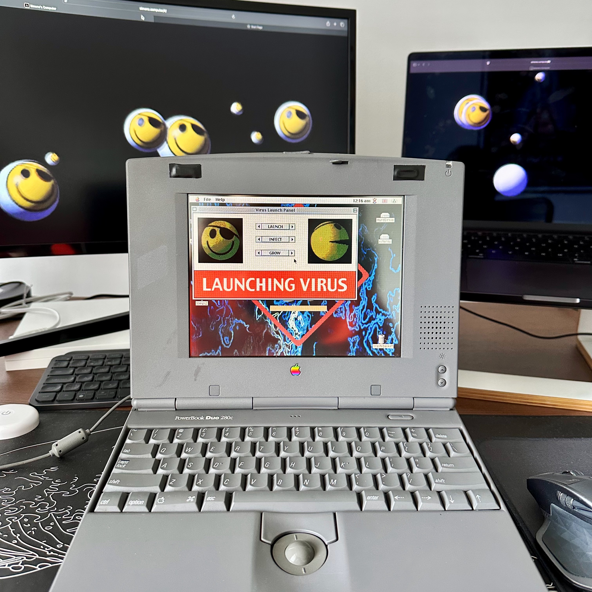

# Powerbook Duo 280c

<a href="media/fullsize.JPG" target="_blank"></a>

## Experiments

 Read my [blog post](https://blog.simone.computer/recreating-hackers-movie-ui) about this project!

I've designed the Virus Launch Panel from the movie Hackers (1995) for a PowerBook Duo 280c.
This REALbasic app connects to an online TCP server and posts a tweet to the Bluesky account: [@hacktheplanet.simone.computer](https://bsky.app/profile/hacktheplanet.simone.computer)

 To run the app you need either Basilisk II or SheepShaver. Of course, you can use a vintage Apple computer running the 68k/PowerPC architecture if you have one lying around.

* The executables were tested on Mac OS 7.5, 8.0, 8.1 and 9.<br>
* [QuickTime 2.5](https://macintoshgarden.org/apps/quicktime-2) is required for the animations and images to work.<br>
* At least 2 MB of free RAM are needed for the app to run correctly.

## Usage

If you open [Archive.sit](https://github.com/syxanash/retrocomputing/raw/refs/heads/master/powerbook-duo-280c/Archive.sit) you should see the following files:

```
├── assets/         // all assets used in the application
├── joeyscode       // the REALbasic application code
├── joeysvirus      // the bundled executable (for 68k)
├── joeysvirus_ppc  // the bundled executable (for PowerPC)
├── joeysvirus_osx  // the bundled executable (for Mac OS X - unstable)
└── source.bas      // text formatted source code
```

Just open one of the executable and use my proxy to run the program and send the tweet to the Bluesky bot: `proxy.hacktheplanet.simone.computer` on the port `8080`. If for some reason I took down the proxy server, you can still test of the animations by entering any HTTP host on the port 80 e.g. `frogfind.com` / `80`.

The exported REALbasic source code is available [here](source.bas). The code is a bit messy and definitely needs some polishing, but I'm more than happy with the result! :)

🔥 If you're running the app on your vintage Apple computer feel free to take a picture and tag me on Bluesky I'll repost it!

## Basilisk Demo

https://github.com/user-attachments/assets/70634e3e-6663-42cd-b5cc-a879ae687da9

## Pics

* [IMG_8819.jpg](media/IMG_8819.jpg) The app running on my Powerbook G4 on Mac OS X 
* [IMG_8824.jpg](media/IMG_8824.jpg) The app running on the same laptop but in Mac OS 9.1 
* [IMG_8985.jpg](media/IMG_8985.jpg) Ultradock 16sce used to expand the ports of the Powerbook Duo and to inser the BlueSCSI DB25
* [IMG_8987.jpg](media/IMG_8987.jpg) One more pic of the program running
