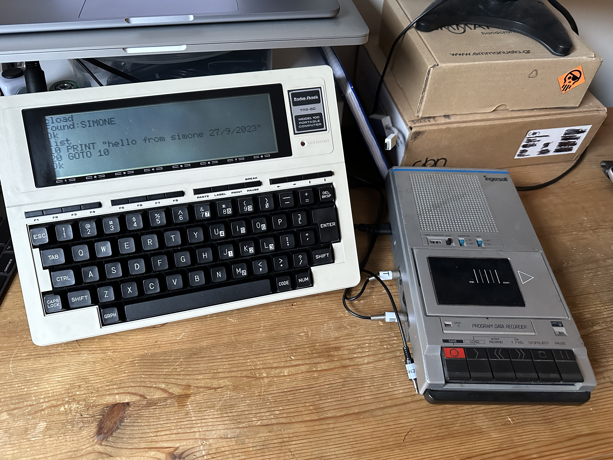

# TRS-80 Model 100



## Experiments

Full blog post available here: https://system31.simone.computer/blog/game-of-life-trs80

Here you can find a Game of Life algorithms I wrote for TRS-80 model 100.
The file with `*T.bas` are transpiled BASIC programs. The simplified ones are those without the `T` at the end of the file name and are slighly easier to read without line numbers.

The program `GOL.bas` runs Game of Life with a spinning loader at the corner of the screen.

https://github.com/syxanash/retrocomputing/assets/1325491/548c9a50-471e-4ba0-aa26-20f35a0cbc7c

The program `GOLLOADER.bas` does the same thing but it also shows a loading bar at the bottom of the screen.

https://github.com/syxanash/retrocomputing/assets/1325491/7c624b1c-6f77-4080-b8b3-378c8cf455c5

Program `MATRIXGOL.bas` is another implementation of Game of Life using a multidimensional array and two nested FOR loops to calculate the generations.

Program `EVENFASTER.bas` is another implementation that does not contain all those MOD operations thus not slowing down the 8085 which does not have the native multiplication or division. It actually runs 10 seconds faster than the other ones :)

The transpiler written in Ruby is called `baspiler.rb` (BAsic tranSPILER 👀). To use it simply run it like this:

```
ruby baspiler.rb PROGRAM.BAS
```

It will output a new file called: `PROGRAMT.BAS`.

`Neighbours.java` instead is the algorithm I sketched before starting to write the actual code in BASIC.
